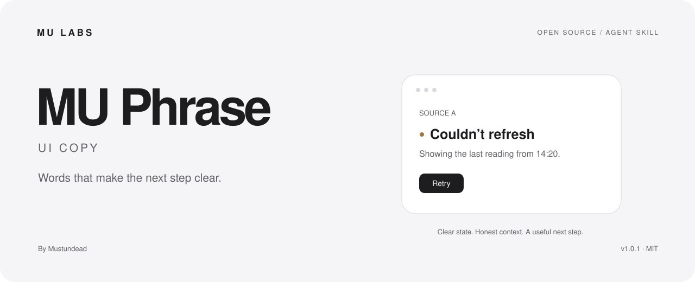

<picture>
  <source media="(prefers-color-scheme: dark)" srcset="assets/cover-dark.svg">
  
</picture>

# MU Phrase · UI Copy

**Interface writing that makes the next step clear.**

[中文](README.md) · [Usage](docs/usage.md) · [Skill](SKILL.md) · [MU LABS](https://mustundead.com/#work)

A personal agent skill by [Mustundead](https://github.com/Mustundead), built around MU LABS product practice. The instructions are written in Chinese and work with the requested Chinese and English interface content.

Use it to write, review, or implement controls, state messages, permissions, purchase copy, localization, and accessible text. It preserves the difference between missing and zero, stale and current, pending and complete.

## Install and invoke

Download the [v1.0.0 release](https://github.com/Mustundead/mu-phrase-ui-copy/releases/tag/v1.0.0) or clone this repository. Place its complete folder in the skill directory configured for your assistant. The MU LABS local Codex workflow uses `~/.codex/skills/mu-phrase-ui-copy`; use your host’s documented discovery path elsewhere. Do not overwrite an existing installation without comparing or backing it up.

Invoke `$mu-phrase-ui-copy` in a new session with the target, available evidence, and requested scope. Read [usage](docs/usage.md) for review versus implementation, updates, and limitations. No account, API key, runtime dependency, or background service is included in this package.

## License and sources

The newly written instructions, documentation, and examples are [MIT licensed](LICENSE). Linked third-party materials retain their own terms. See [sources](references/sources.md) for attribution and adaptation boundaries. These are independent MU LABS methods, not an official Apple or OpenAI product.
