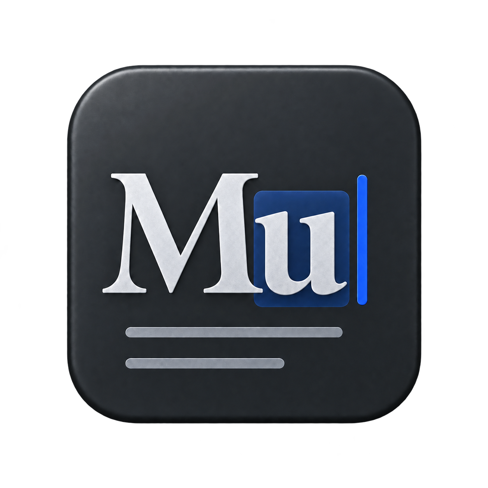

<picture>
  <source media="(prefers-color-scheme: dark)" srcset="assets/cover-dark.svg">
  
</picture>



# MU Phrase · UI 文案

**界面文案 · 每一句，都让下一步更清楚。**

[下载 v1.0.1](https://github.com/Mustundead/mu-phrase-ui-copy/releases/tag/v1.0.1) · [English](README.en.md) · [使用文档](docs/usage.md) · [完整技能](SKILL.md) · [MU LABS](https://mustundead.com/#work)

由 [Mustundead](https://github.com/Mustundead) 编写的个人 Agent Skill，把 MU LABS 的产品判断整理成可反复使用的工作方法。支持以 `SKILL.md` 为入口的助手工作流；技能指令以中文编写，可以处理约定范围内的中英文产品内容。

## 为什么叫 MU Phrase

Phrase 是措辞与表达。它关心一句话在什么场景出现、说明什么事实，以及如何帮助人作出选择。 MU 是 MU LABS 的共同署名，功能由副标题说明。

## 它能做什么

中英文控件、空状态、错误、权限、订阅、数据状态、本地化与无障碍文本。

提供改写/局部修正、评审、实现与审计等按需路径。保留原有产品、框架和用户授权；简单问题直接处理，重要行为用实际证据确认。

它不把未知写成零，不把请求写成完成，也不通过删掉数据后果来压缩字数。

## 一句话，也有完整的上下文

| 看见的情况 | MU Phrase 关注的判断 |
| --- | --- |
| 按钮让人犹豫 | 动词是否准确，选择之后会发生什么 |
| 数值没更新 | 保留上次读数和时间，区分未知与零 |
| 删除或断开连接 | 先核对对象、范围和后果，再写提示 |
| 中英文共用一个键 | 检查调用语境、变量和其他语言的解析 |
| 屏幕上已经说清楚 | 读屏是否仍能得到同样完整的信息 |

**例如：一个来源刷新失败，另一个来源正常。**

> 未能更新。显示 14:20 读取的数据。<br>
> Couldn’t refresh. Showing data from 14:20.

仅当旧数据仍然存在时采用这种表达。失败只属于对应来源，其他有效结果继续保留。更多前提与例子见 [MU LABS 示例](references/examples.md)。

## 开始使用

1. 下载 [v1.0.1](https://github.com/Mustundead/mu-phrase-ui-copy/releases/tag/v1.0.1) 或克隆本仓库。
2. 将包含 `SKILL.md`、`references/`、`agents/` 和 `assets/` 的 `mu-phrase-ui-copy` 文件夹放进助手已配置的技能目录。MU LABS 的本地 Codex 工作流使用 `~/.codex/skills/`；其他环境按其技能发现设置选择目录。
3. 在新的会话中调用 `$mu-phrase-ui-copy`，并说明目标、材料和工作范围。

已有同名目录时先比较或备份，不直接覆盖。详见[安装、更新与移除](docs/usage.md)。

```text
使用 $mu-phrase-ui-copy。检查这张连接卡片的中英文文案。一个来源刷新失败但保留了旧值，另一个来源正常。先评审，不修改代码。
```

## 从一个具体任务开始

**先看哪里需要改。**

```text
使用 $mu-phrase-ui-copy。检查当前页面的按钮、空状态和错误提示，给出问题、建议文案与理由。先评审，不改代码。
```

**直接完成修改。**

```text
使用 $mu-phrase-ui-copy。在当前项目中修改这个页面的中英文文案，保留变量和实际行为，检查相关语言资源与运行界面。
```

评审交付问题与建议；实现交付修改和验证结果。附上页面、截图或项目位置，就能让任务更具体。

## 内容结构

- [SKILL.md](SKILL.md)：触发范围、决策方法、实施与验收。
- [references/](references/)：按任务加载的细节和 MU LABS 教学示例。
- [agents/openai.yaml](agents/openai.yaml)：助手界面元数据与示例调用。
- [使用文档](docs/usage.md)：安装、调用、工作模式和证据边界。
- [评估情境](docs/evaluation.md)：维护时用于检查行为的题目。
- [资料与取舍](references/sources.md)：来源、采用的原则及适用边界。

## 许可与贡献

本仓库新写的技能、文档和示例以 [MIT](LICENSE) 开源，可使用、修改和再分发，需保留许可证声明。链接的外部资料仍遵循各自条款。产品和平台名称用于说明语境，不表示官方关联或背书。

问题或改进建议请附具体场景、实际行为和期望结果；见[贡献说明](CONTRIBUTING.md)。与另一项 [MU Poise](https://github.com/Mustundead/mu-poise-ui-design) 可共同使用，但共享的检查只做一次。
